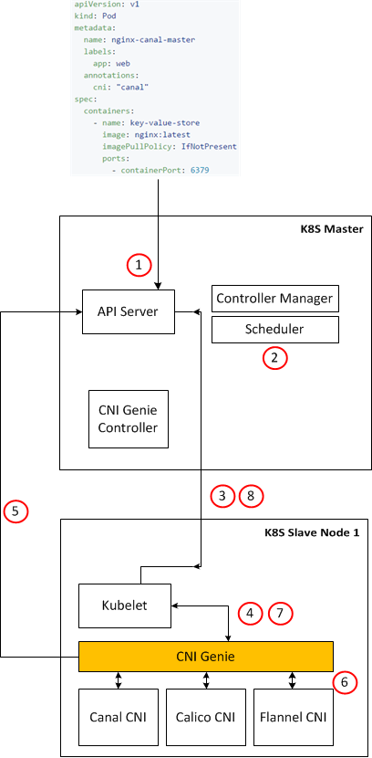

## You can find here our [existing & future features covered in CNI-Genie](CNIGenieFeatureSet.md)

# CNI Genie High Level Design

## Overview

From the viewpoint of Kubernetes kubelet CNI-Genie is treated the same as any other CNI plugin. As a result, no changes to Kubernetes are required. CNI Genie proxies for all of the CNI plugins, each providing a unique container networking solution, that are available on the host.

We start Kubelet with **"genie"** as the CNI **"type"**. Note that for this to work we must have already placed **genie** binary under /opt/cni/bin as detailed in [getting started]( GettingStarted.md)
  * This is done by passing /etc/cni/net.d/genie.conf to kubelet

```json
{
    "name": "k8s-pod-network",
    "type": "genie",
    "etcd_endpoints": "http://10.96.232.136:6666",
    "log_level": "debug",
    "policy": {
      "type": "k8s",
       "k8s_api_root": "https://10.96.0.1:443",
       "k8s_auth_token": "eyJhbGciOiJSUzI1NiIsInR5cCI6IkpXVCJ9.eyJpc3MiOiJrdWJlcm5ldGVzL3NlcnZpY2VhY2NvdW50Iiwia3ViZXJuZXRlcy5pby9zZXJ2aWNlYWNjb3VudC9uYW1lc3BhY2UiOiJrdWJlLXN5c3RlbSIsImt1YmVybmV0ZXMuaW8vc2VydmljZWFjY291bnQvc2VjcmV0Lm5hbWUiOiJjYWxpY28tY25pLXBsdWdpbi10b2tlbi13Zzh3OSIsImt1YmVybmV0ZXMuaW8vc2VydmljZWFjY291bnQvc2VydmljZS1hY2NvdW50Lm5hbWUiOiJjYWxpY28tY25pLXBsdWdpbiIsImt1YmVybmV0ZXMuaW8vc2VydmljZWFjY291bnQvc2VydmljZS1hY2NvdW50LnVpZCI6ImJlZDY2NTE3LTFiZjItMTFlNy04YmU5LWZhMTYzZTRkZWM2NyIsInN1YiI6InN5c3RlbTpzZXJ2aWNlYWNjb3VudDprdWJlLXN5c3RlbTpjYWxpY28tY25pLXBsdWdpbiJ9.GEAcibv-urfWRGTSK0gchlCB6mtCxbwnfgxgJYdEKRLDjo7Sjyekg5lWPJoMopzzPu8_-Tddd-yPZDJc44NCGRep7_ovjjJdlQvjhc0g1XA7NS8W0OMNHUJAzueyn4iuEwDHR7oNS_nwMqsfzgCsiIRkc7NkQDtKaBj8GOYTz9126zk37TqXylh7hMKlwDFkv9vCBcPv-nYU22UM67Ux6emAtf1g1Yw9i8EfOkbuqURir66jtcnwh3HLPSYMAEyADxYtYAxG9Ca-HhdXXsvnQxhd4P0h2ctgg0_NLTO6WRX47C3GNheLmq0tNttFXya0mHhcElSPQFZftzGw8ZvxTQ"
      },
    "kubernetes": {
      "kubeconfig": "/etc/cni/net.d/genie-kubeconfig"
    }
}
```
## Detailed workflow

A detailed illustration of the workflow is given in the following figure:



* Step 1.	a “Pod” object is submitted to API Server by the user
* Step 2.	Scheduler schedules the pod to one of the slave nodes
* Step 3.	Kubelet of the slave node picks up the pod from API Server and creates corresponding container
* Step 4.	Kubelet passes the following to CNI-Genie
  * a.	CNI_COMMAND
  * b.	CNI_CONTAINERID
  * c.	CNI_NETNS
  * d.	CNI_ARGS (K8S_POD_NAMESPACE, K8S_POD_NAME)
  * e.	CNI_IFNAME (always eth0, please see kubernetes/pkg/kubelet/network/network.go)
* Step 5.	CNI-Genie queries API Server with K8S_POD_NAMESPACE, K8S_POD_NAME to get the “pod” object, from which it parses “cni” plugin type, e.g., canal, weave 
* Step 6.	CNI-Genie queries the cni plugin of choice with parameters from Step 4 to get IP Address(es) for the pod
* Step 7.	CNI-Genie returns the IP Address(es) to Kubelet
* Step 8.	Kubelet updates the “Pod” object with the IP Address(es) passed from CNI-Genie

