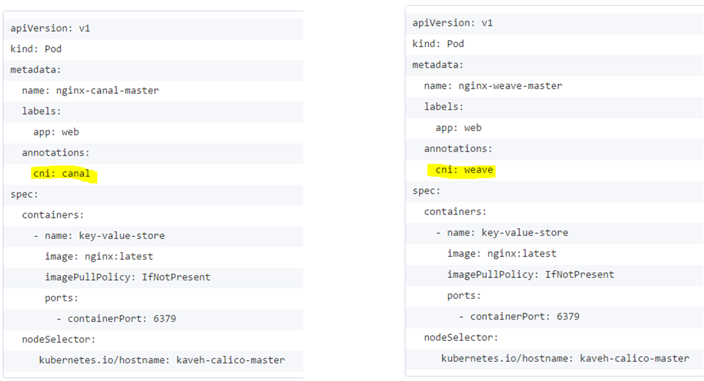
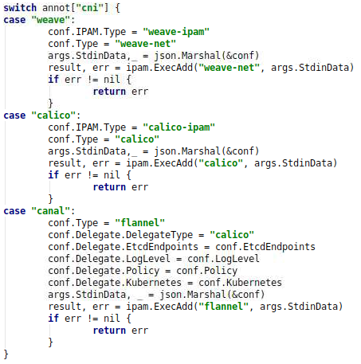

## Kubernetes CNI plugin limitation

Right now Kubernetes Kubelet running on a slave node connects to atmost one CNI plugin only i.e. either Canal or Romana or Weave.
We were looking for a way if we can allow a pod scheduled to run on a Node can pickup over run time any of the existing CNI plugins running on that particular node.

The current limitation and the reason why Kubernetes cannot do this is that when you are starting the kubelet, you are expected to pass cni-plugin details as a part of 'kubelet' process.
In this case you have to pick either of the 3 CNI plugins and passed as a flags to the kubelet.

Now that's in a way a we feel is too restrictive. What if we want to use certain set of pods use Canal networking and other set of pods use weave networking? This is currently not possible in Kubernetes. 
For any multi-network support we need changes to be done to the Kubernetes, which leads to backward compatibility issues.

So here we've CNI-Genie that's designed to solve this problem statement without touching the Kubernetes code! 

## What CNI-Genie does?
We will try to explain here how CNI-Genie is designed to work. 

## How CNI-Genie works?

* Step 1: 
  * We start Kubelet with **genie** as the CNI binary
  * This is done by passing /etc/cni/net.d/genie.conf to kubelet
  

* Step 2:
  * User inputs his network of choice in **pod annotations**
  

* Step 3
  * Genie gets pod name from args passed by kubelet
* Step 4
  * Genie gets pod annotations from api-server

* Step 5
  * Call the network choice requested by the user

