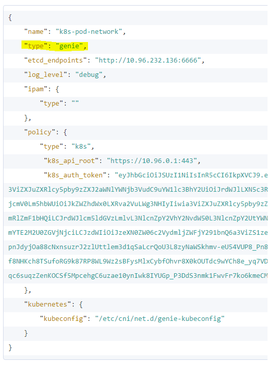

## You can find here our [features covered in each CNI-Genie version](FutureEnhancements.md)

# Feature 1: CNI-Genie "Multiple CNI Plugins"

## Motivation behind Multiple CNI Plugins

Right now Kubernetes Kubelet running on a slave node connects to at most one CNI plugin only i.e. either Canal or Romana or Weave.
This CNI-Genie feature enbales a pod, scheduled to run on a Node, to pickup over runtime any of the existing CNI plugins running on that particular node.

The current limitation and the reason why Kubernetes cannot do this is that when you are starting the kubelet, you are expected to pass cni-plugin details as a part of 'kubelet' process. In this case you have to pick only one of the existing CNI plugins and pass it as a flag to the kubelet. Now we feel that's in a way too restrictive! What if we want certain set of pods to use Canal networking and other set of pods to use weave networking? This is currently not possible in Kubernetes. For any multi-network support we need changes to be done to the Kubernetes, which leads to backward compatibility issues.

So, CNI-Genie "Multiple CNI Plugins" feature is designed to solve this problem without touching the Kubernetes code! 

## What CNI-Genie v1 does?
We will try to explain here how "Multiple CNI Plugins" feature is designed to work. 

## How CNI-Genie v1 works?

* Step 1: 
  * We start Kubelet with **genie** as the CNI binary
  * This is done by passing /etc/cni/net.d/genie.conf to kubelet
  

* Step 2:
  *  The user manually select the CNI plugin(s) that he wants to add to a container upon creating a pod object. This goes under **pod annotations**
  

* Step 3
  * Genie gets pod name from args passed by kubelet
* Step 4
  * Genie gets pod annotations from api-server

* Step 5
  * Call the network choice requested by the user

### You can find here our [version-wise planned releases](FutureEnhancements.md)

### You can find here [Problem Statements](INTRODUCTION.md)

### [High-Level Design](HLD.md)

