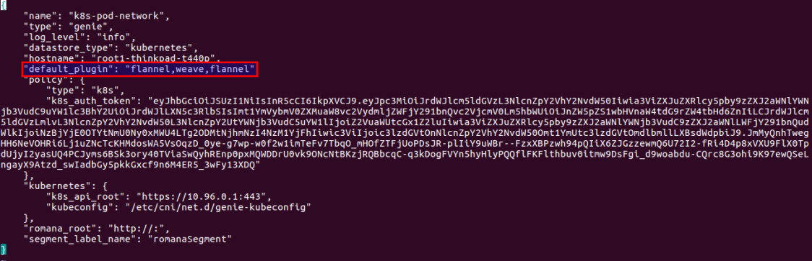
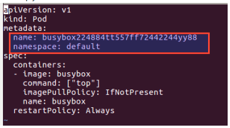
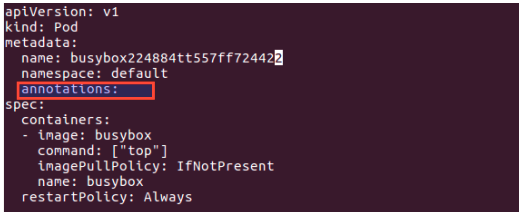

# Feature 4: CNI-Genie "Default Plugin Selection"

# Usecase

There are many cases/user scenarios where we want the pod to have ip(s) from a default network which we choose. For this case, CNI Genie provides a very useful default plugin support feature.
For using this feature, we can update the genie conf file to set the plugin of our choice as default plugin

Once this is set, we don't have to make any cni changes to the pod yaml while creating subsequent pods and the ip(s) from default plugins will be ensured. This config can be updated/modified at any point of time and will reflect in subsequent run

# Modification to genie conf file
Genie conf file can be modified as shown below to set default plugin. The plugin list can contain multiple plugins and also same plugin name multiple times incase we wish to get multiple ips for pod from same plugin (Provided choosen plugin has the support for this)

# Pod yaml file for default plugin usage
If the pod yaml does not contain any annotation related to cni genie or contains blank annotation, it will be assumed to have requested for deafult plugin

so below pod yamls indicate the request to use default plugin

Note: Incase above pod yamls are used and genie conf file is not set with any default plugin, in current implementation, weave is selected as the plugin to be used by default
