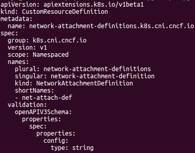
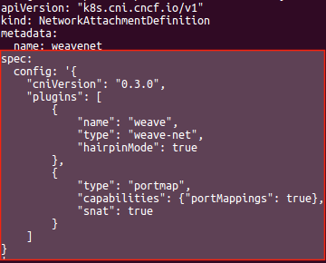
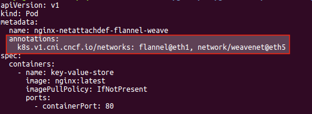
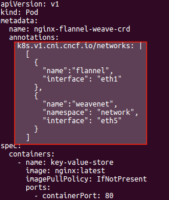
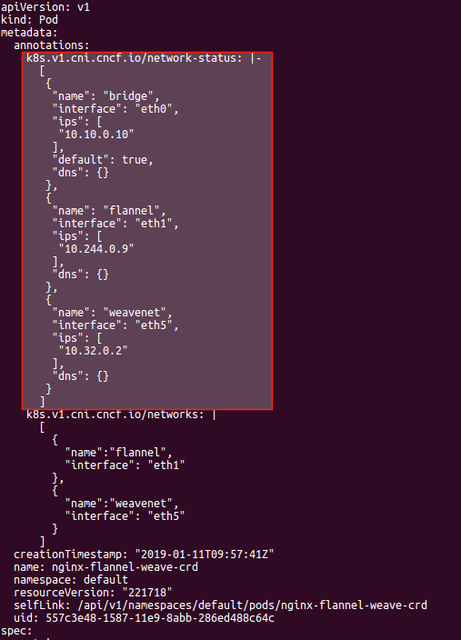
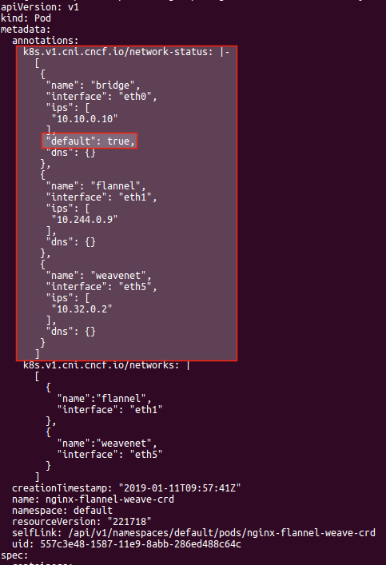

## You can find here our [existing & future features covered in CNI-Genie](../CNIGenieFeatureSet.md)

# Feature 3: Network Attachment Definitions

NetworkAttachmentDefinition objects are CRD objects through which user can specify plugin configuration and then pods can use these objects for network attachments.

This feature is the realization of Kubernetes Network Custom Resource Definition De-facto Standard. More details [here](https://github.com/K8sNetworkPlumbingWG/multi-net-spec).

### NetworkAttachmentDefinition CRD definition:

yaml: [netattachdef-crd.yaml](../../sampleyamls//netattachdef-yamls/netattachdef-crd.yaml)

### NetworkAttachmentDefinition object examples:

#### With plugin configuration as spec:

yaml: [netattachdef-config-in-spec.yaml](../../sampleyamls/netattachdef-yamls/example-weavenet-crd-conf-in-spec.yaml)

#### With plugin configuration as file:

yaml: [netattachdef-config-in-file.yaml](../../sampleyamls//netattachdef-yamls/example-weavenet-crd-conf-in-file.yaml)

### Creating pod using network-attachemnt-definition objects

#### Pod with annotaion specifying object name

yaml: [pod-using-netattachdef-format-names.yaml](../../sampleyamls//netattachdef-yamls/pod-using-netattachdef-format-names.yaml)

#### Pod with annotation in json format:

yaml: [pod-using-netattachdef-format-json.yaml](../../sampleyamls//netattachdef-yamls/pod-using-netattachdef-format-json.yaml)

### Network status annotation

Network status annotation shows the result of network attachment (in json format) in the pod object.

### Cluster-Wide Default Network

As per network CRD De-facto standard, a default network attachs to a pod first, along with other specified network attachments afterwards. When no other network attachment is specified in the network annotation, then the pod gets IP from the default network. Interface name 'eth0' is reserved for this network attachment. The default network is choosen based on the first valid configuration file present in the net dir (/etc/cni/net.d) in a node.

