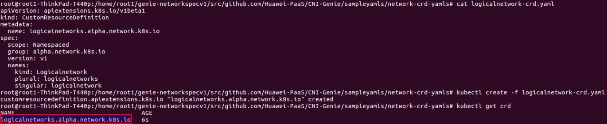
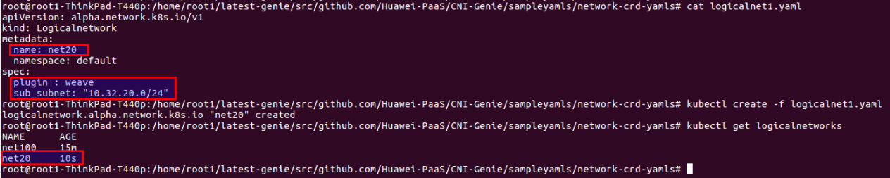
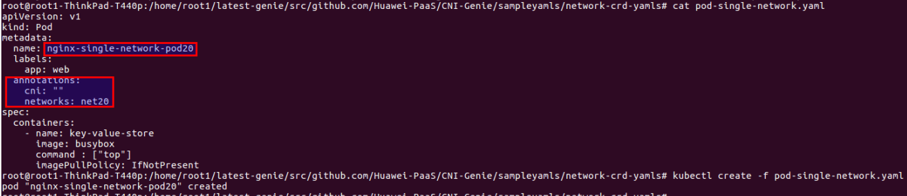
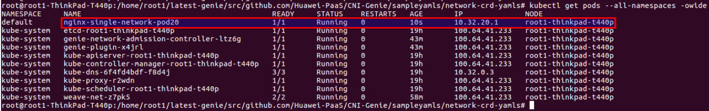

## You can find here our [existing & future features covered in CNI-Genie](../CNIGenieFeatureSet.md)

# Feature 5: CNI-Genie "Network Isolation"

## Use Case 1: Pod getting ip address from the customized subnet of desired plugin

### Steps

Step 1 : Create a logical network crd object. 

Step 2 : Create a logical network specifying network plugin and customized subnet intended to be used

Step 3 : Create a  pod using by specifying this logical network as pod annotation

[Reference Yamls](../../sampleyamls/network-crd-yamls/)

### Verification : Pod can be seeing having ip address from customized subnet from input plugin

### Note : We need to make sure that the customized subnet falls under plugin network range

