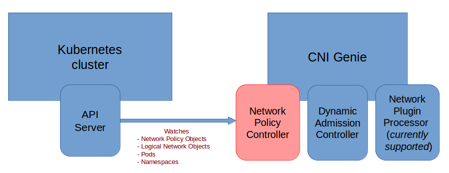
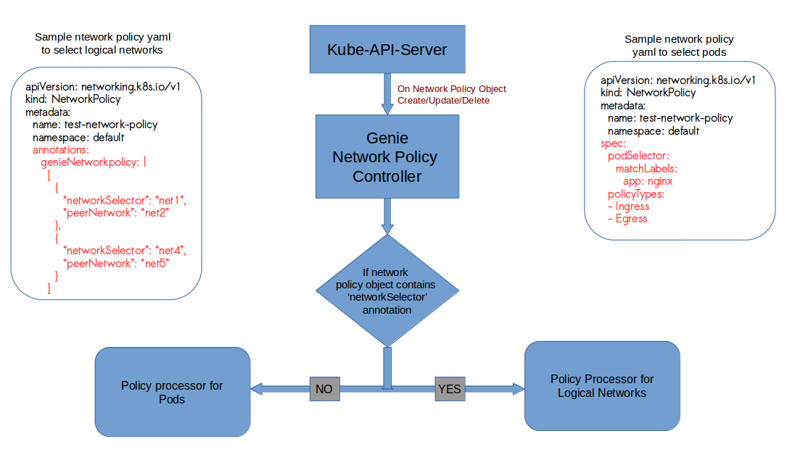

## You can find here our [existing & future features covered in CNI-Genie](../CNIGenieFeatureSet.md)

# Feature 6: CNI-Genie "Network Policy Engine"
NOTE: This feature is currently under implementation.

## Use Case
A stand-alone policy engine that serves as a gateway/firewall for network traffic. This engine will be capable of talking to variety of CNSs. Key features of this policy engine is providing network isolation in logical network level as well as pod level.

## Design Overview of Genie Network Policy Engine


## Processing of Network Policy Object by Genie Policy Engine
The policy engine will process a network policy object based on 'genieNetworkpolicy' annotation field and routes the execution flow to appropriate policy processor.



#### Sample network policy yaml to select logical networks

```yaml
apiVersion: networking.k8s.io/v1
kind: NetworkPolicy
metadata:
  name: test-network-policy
  namespace: default
  annotations:
    genieNetworkpolicy: |
      [
        {
          networkSelector: net1
          peerNetworks: net2
        },
        {
          networkSelector: net4
          peerNetworks: net3,net5 
        }
      ]
 ```     
## Different scenarios of network policy implementation
### Scenario 1
##### ***Logical networks present:*** 
net1, net2, net3, net4

##### ***Network Policy Definition:***
No network policy has been defined
  
##### ***Expected behaviour:***
Any network can communicate with any network

### Scenario 2
##### ***Logical Networks present:***
net1, net2, net3, net4

##### ***Network Policy Definitions:***
```yaml
apiVersion: networking.k8s.io/v1
metadata:
  name: access-nginx
  annotations:
    genieNetworkpolicy: |
      [
        {
          networkSelector: net1
          peerNetworks: net2
        }
      ]  
```
##### ***Expected behaviour:***
net1 and net2 can communicate with each other

No communication between net1 and any other networks

net2, net3 and net4 can communicate with each other

### Scenario 3
##### ***Logical Networks present:***
net1, net2, net3, net4

##### ***Network Policy Definitions:***
```yaml
apiVersion: networking.k8s.io/v1
metadata:
  name: access-nginx
  annotations:
    genieNetworkpolicy: |
      [
        {
          networkSelector: net1
          peerNetworks: net2
        },
        {
          networkSelector: net1
          peerNetworks: net3 
        }
      ]  
```
##### ***Expected behaviour:***
net1 and net2 can communicate with each other

net1 and net3 can communicate with each other

No communication between net1 and any other networks

net2, net3 and net4 can communicate with each other

### Scenario 4
##### ***Logical Networks present:***
net1, net2

##### ***Network Policy Definitions:***
```yaml
apiVersion: networking.k8s.io/v1
metadata:
  name: access-nginx
  annotations:
    genieNetworkpolicy: |
      [
        {
          networkSelector: net1
          peerNetworks: net4
        }
      ]  
```
##### ***Expected behaviour:***
Now the network policy object specifies that net1 should allow commnication from a network that is not present in the cluster. So, net1 can not allow communication from any other network, as the only network it allows communication from is not present.

##### ***Now L4 is created. So,***
Logical Networks present : net1, net2, net4

##### ***Network policy object remains the same***

##### ***Expected behaviour:***
net1 and net4 can communicate with each other

No communication between net1 and any other networks

net2 and net4 can communicate with each other

### Scenario 5

##### ***Logical Networks present:***
net1, net2, net3, net4

##### ***Network Policy Definitions:***
```yaml
apiVersion: networking.k8s.io/v1
metadata:
  name: access-nginx
  annotations:
    genieNetworkpolicy: |
      [
        {
          networkSelector: net1
          peerNetworks: net2,net3
        }
      ]  
```
##### ***Expected behaviour:***
net1 and net2 can communicate with each other

net1 and net3 can communicate with each other

No communication between net1 and any other networks

net2, net3 and net4 can communicate with each other

##### ***Now, to deny communication between L1 and L2, edit the network policy object***
```yaml
apiVersion: networking.k8s.io/v1
metadata:
  name: access-nginx
  annotations:
    genieNetworkpolicy: |
      [
        {
          networkSelector: net1
          peerNetworks: net2    # Removed net3
        }
      ]  
```
##### ***Expected behaviour:***
net1 and net2 can communicate with each other

No communication between net1 and any other networks

net2, net3 and net4 can communicate with each other
