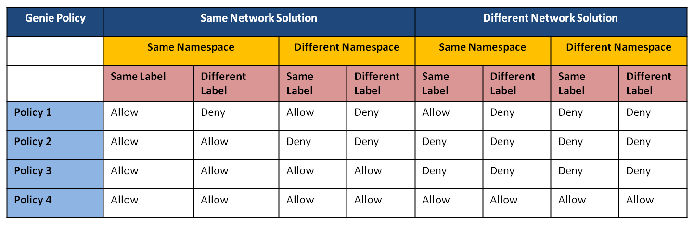

## Network Policy Engine

A stand-alone policy engine that serves as a gateway/firewall for network traffic. This engine will be capable of talking to variety of CNSs. Key feature of this engine is Network Solution specific policy rules as defined in below table.

