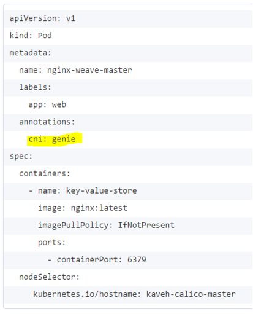

## You can find here our [features covered in each CNI-Genie version](../CNIGenieFeatureSet.md)

# Feature 3: CNI-Genie "Smart CNI Plugin Selection"

# Use Case

* Upon creating a pod, the user can manually select the logical network, or multiple logical networks, that the pod should be added to
*	If upon creating a pod no logical network is included in the yaml configuration, CNI Genie will automatically select one of the available CNI plugins
   *	CNI Genie maintains a list of KPIs for all available CNI plugins. Examples of such KPIs are occupancy rate, number of subnets, response times

# How it should work

In this case user leaves CNI-Genie to decide ideal logical network to be picked up for the pod. For this user just defines "cni: genie" in the pod definition.

CNI-Genie uses a **criterion** to choose the best network. Following are few options we can look at (not limited to only this list):

   * Option 1: Percentage of **IP addresses used vs available**: Crude example just for the understanding goes this way - Cosider a node with Canal and Weave networks. Canal's IP usage is 90% and weave's IP usage is 10%. Then a new pod definition from user would be connected to weave.
   * Option 2: Current **network performance** (delay, bandwidth, jitter). Idea is to measure and log bandwidth usage through iperf3.
       
       
       
   * Option 3: Questionnaire - <more to be identified>

