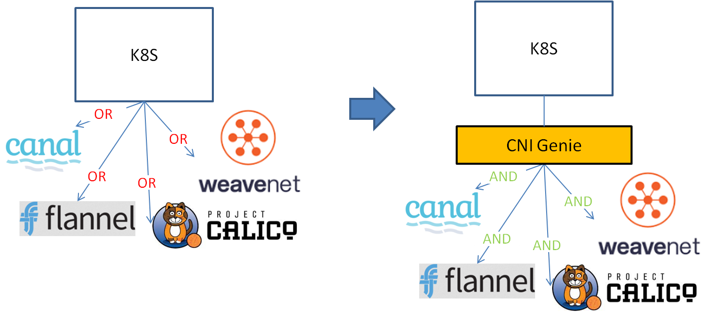
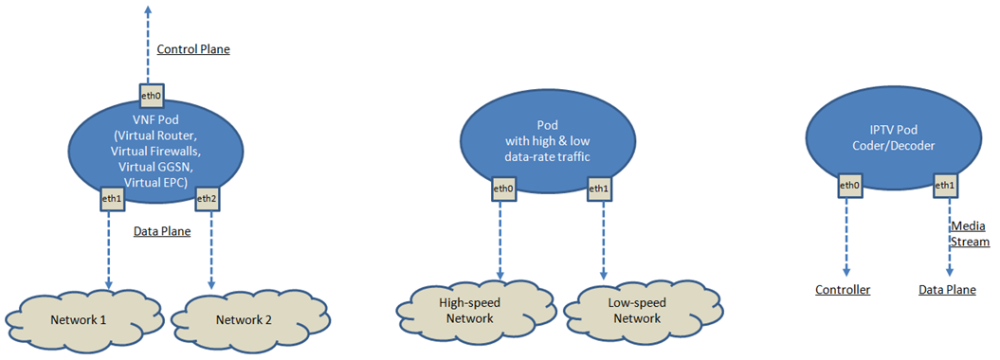

# CNI-Genie

CNI-Genie enables container orchestrators ([Kubernetes](https://github.com/kubernetes/kubernetes), [Mesos](https://mesosphere.com/)) to seamlessly connect to the choice of CNI plugins installed on a host, including
1. ['reference' CNI plugins](https://github.com/containernetworking/plugins), e.g., bridge, macvlan, ipvlan, loopback
2. '3rd-party' CNI plugins, e.g., ([Calico](https://github.com/projectcalico/calico), [Romana](https://github.com/romana/romana), [Weave-net](https://github.com/weaveworks/weave))
3. 'specialized' CNI plugins, e.g., [SR-IOV](https://github.com/hustcat/sriov-cni), DPDK (work-in-progress)
4. any generic CNI plugin of choice installed on the host

Without CNI-Genie, the orchestrator is bound to only a single CNI plugin. E.g., for the case of Kubernetes, without CNI-Genie, kubelet is bound to only a single CNI plugin passed to kubelet on start. CNI-Genie allows for the co-existance of multiple CNI plugins  in runtime. 

Please feel free to post your feedback, questions on CNI-Genie [Slack channel](https://cni-genie.slack.com/)

## Demo
Here is a 6 minute demo video that demonstrates 3 scenarios
1. Assign an IP address to a pod from a particular network solution, e.g., 'Weave-net'
2. Assign multi-IP addresses to a pod from multiple network solutions, e.g., 1st IP address from 'Weave-net', 2nd IP address from 'Canal'
3. Assign an IP address to a pod from the "less congested" network solution, e.g., from 'Canal' that is less congested

# Contributing
[Contributing](../../CONTRIBUTING.md)

[Code of Conduct](../../CODE_OF_CONDUCT.md)

# Why we created CNI-Genie?

CNI Genie is an add-on to [Kuberenets](https://github.com/kubernetes/kubernetes) open-source project and is designed to provide the following features:

1. [wide range of network offerings, CNI plugins](../../docs/multiple-cni-plugins/README.md), available to the users in runtime. This figure shows Kubernetes CNI Plugin landscape before and after CNI-Genie
   
    - User-story: based on "performance" requirements, "application" requirements, “workload placement” requirements, the user could be interested to use different CNI plugins for different application groups
    - Different CNI plugins are different in terms of need for port-mapping, NAT, tunneling, interrupting host ports/interfaces
    
[Watch multiple CNI plugins demo](https://github.com/cni-genie/CNI-Genie/blob/master/docs/multiple-cni-plugins/README.md#demo)

2. [Multiple NICs per container & per pod](../../docs/multiple-ips/README.md). The user can select multiple NICs to be added to a container upon creating them. Each NIC can get an IP address from an existing CNI plugin of choice. This makes the container reachable across multiple networks. Some use-cases from [SIG-Network](https://github.com/kubernetes/community/wiki/SIG-Network) are depicted in the figure below
   
        
[Watch multi-NICs per 'container' demo](https://github.com/cni-genie/CNI-Genie/blob/master/docs/multiple-ips/README.md#demo)

[Watch multi-NICs per 'pod' demo](https://github.com/cni-genie/CNI-Genie/blob/master/docs/multiple-ips/README.md#feature-2-extension-cni-genie-multiple-ip-addresses-per-pod) (IP addresses assigned not only to the container, but also to the Pod)

3. [Network Attachment Definition](../../docs/network-attachment-definitions/README.md). CNI-Genie supports [NPWG Multi-Network Specification v1](https://github.com/K8sNetworkPlumbingWG/multi-net-spec) style network attachment to pods, where pods can be assigned IP according to network-attachment-definition CRD objects created by user.

4. The user can leave the CNI plugin selection to CNI-Genie. CNI-Genie watches the Key Performance Indicator (KPI) that is of interest to the user and [selects the CNI plugin](../../docs/smart-cni-genie/README.md), accordingly.
    - CNI Genie watches KPI(s) of interest for existing CNI plugins, e.g., occupancy rate, number of subnets, latency, bandwidth

[Watch Smart CNI Plugin Selection demo](https://github.com/cni-genie/CNI-Genie/blob/master/docs/smart-cni-genie/README.md#demo)

5. [Default plugin support](../../docs/default-plugin/README.md). Another useful feature from genie. Using this, we can ensure to get ip address(es) for a pod by selecting default set of plugins

6. Network isolation, i.e.,
    - Dedicated 'physical' network for a tenant
    - Isolated 'logical' networks for different tenants on a shared 'physical'network

    Usecase : [Obtaining Pod Ip address from customized subnet](../../docs/network-isolation/README.md)

7. [CNI-Genie network policy engine](../../docs/network-policy/README.md) for network level ACLs

8. Real-time switching between different (physical or logical) networks for a given workload. This allows for
    - Price minimization: dynamically switching workload to a cheaper network as network prices change    
    - Maximizing network utilization: dynamically switching workload to the less congested network at a threshold
    
    

Note: CNI-Genie itself is NOT a routing solution! It makes a call to CNI plugins that provide routing service

### More docs here [Getting started](GettingStarted.md), [CNI-Genie Feature Set](CNIGenieFeatureSet.md)

